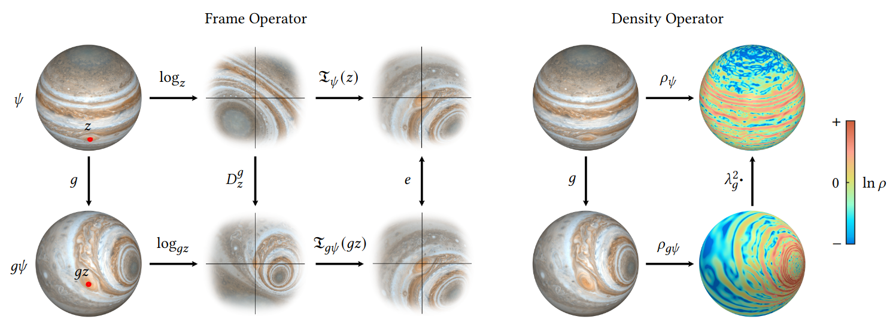

# MobiusConv

The official PyTorch implementation of Möbius Convolutions from the SIGGRAPH 2022 paper.

### [[Paper: Möbius Convolutions for Spherical CNNs]](https://www.mitchel.computer/papers/MobConv_2022.pdf)

Code coming soon!
